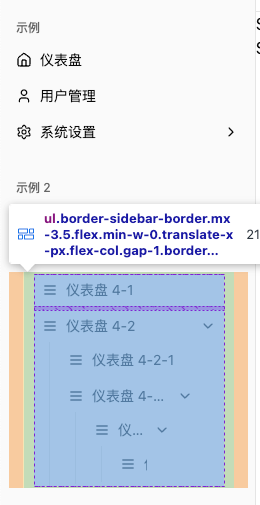

# 菜单导航栏实现方案

## 特性

1. 🔗 支持多级菜单
2. 🔘 支持折叠菜单
3. 🎨 支持菜单项的图标显示
4. 💡 支持菜单项的提示信息
5. 🎭 支持权限校验
6. 🫥 支持菜单项隐藏

## 实现方案

### 1. 多级菜单

#### 1.1 SidebarAllMenus

```tsx
/**
 * 所有菜单
 */
function SidebarAllMenus() {
  return menu.map((group: MenuGroup, groupIndex: number) => {
    return (
      <SidebarGroup key={`group-${groupIndex}-${group.groupLabel}`}>
        {/* 组标签 */}
        <SidebarGroupLabel>{group.groupLabel}</SidebarGroupLabel>
        {/* 组内容 */}
        <SidebarGroupContent>
          {/* 菜单项 */}
          <SidebarMenuItems items={group.items} />
        </SidebarGroupContent>
      </SidebarGroup>
    )
  })
}
```

#### 1.2 SidebarMenuItems

```tsx
/**
 * 菜单项
 * @param items 菜单项列表
 */
function SidebarMenuItems({ items }: { items: MenuItem[] }) {
  return (
    <SidebarMenu>
      {items.map((item, index) => (
        <HierarchicalMenu key={`${item.path}-${index}`} item={item} />
      ))}
    </SidebarMenu>
  )
}
```

#### 1.3 HierarchicalMenu

```tsx
/**
 * 实现层级菜单的渲染，递归渲染
 * @param item 菜单项
 * @returns
 */
function HierarchicalMenu({ item }: { item: MenuItem }) {
  const location = useLocation()
  const hasChildren = !!(item.children && item.children.length > 0)
  const isActive = isPathMatchMenuItem(location.pathname, item)
  const { path, title, icon } = item

  // 没有子菜单时，渲染单个菜单项
  if (!hasChildren) {
    return (
      <SidebarMenuItem>
        <TooltipWrapper title={title}>
          <SidebarMenuButton asChild isActive={isActive}>
            <NavLink to={path}>
              {/* icon */}
              <MenuIcon icon={icon} />
              {/* title */}
              <p className="truncate">{title}</p>
            </NavLink>
          </SidebarMenuButton>
        </TooltipWrapper>
      </SidebarMenuItem>
    )
  }

  // 有子菜单时，渲染折叠菜单项
  return (
    <Collapsible asChild className="group/collapsible">
      <SidebarMenuItem>
        {/* 折叠触发器 */}
        <TooltipWrapper title={title}>
          <CollapsibleTrigger asChild>
            <SidebarMenuButton>
              {/* icon */}
              <MenuIcon icon={icon} />
              {/* title */}
              <p className="truncate">{title}</p>
              {/* 折叠指示器 */}
              <FoldIcon />
            </SidebarMenuButton>
          </CollapsibleTrigger>
        </TooltipWrapper>

        {/* 折叠内容 */}
        <CollapsibleContent>
          {/* 递归渲染子菜单 */}
          <SidebarMenuSub className="pr-0 mr-0">
            {item.children?.map((child, childIndex) => (
              <HierarchicalMenu
                key={`${child.path}-${childIndex}`}
                item={child}
              />
            ))}
          </SidebarMenuSub>
        </CollapsibleContent>
      </SidebarMenuItem>
    </Collapsible>
  )
}
```

### 2. 折叠菜单

```tsx
<Collapsible asChild className="group/collapsible">
  <SidebarMenuItem>
    {/* 折叠触发器 */}
    <CollapsibleTrigger asChild>{...}</CollapsibleTrigger>

    {/* 折叠内容 */}
    <CollapsibleContent>{...}</CollapsibleContent>
  </SidebarMenuItem>
</Collapsible>
```

### 3. 菜单项的图标显示

通过 `resolveIcon` 函数，根据菜单项的 `icon` 属性，渲染对应的图标。

```tsx
/**
 * 菜单图标
 * @param icon 图标
 */
function MenuIcon({ icon }: { icon: string | undefined }) {
  return icon ? resolveIcon(icon) : <Menu className="w-4 h-4" />
}
```

```tsx
import * as Icons from 'lucide-react'
import type { LucideIcon } from 'lucide-react'
import type { JSX } from 'react'

export function resolveIcon(name: string): JSX.Element | null {
  const Icon = name && (Icons as unknown as Record<string, LucideIcon>)[name]
  return Icon ? <Icon className="w-4 h-4" /> : null
}
```

### 4. 菜单项的提示信息

封装 `TooltipWrapper` 组件，用于包裹菜单项，并显示提示信息。

```tsx
function TooltipWrapper({
  children,
  title,
}: {
  children: React.ReactNode
  title: string
}) {
  return (
    <Tooltip delayDuration={800}>
      <TooltipTrigger asChild>{children}</TooltipTrigger>
      <TooltipContent side="right">{title}</TooltipContent>
    </Tooltip>
  )
}
```

### 5. 菜单项的权限校验

通过 `usePermissionsCheck` 钩子，根据菜单项的 `permissions` 属性，判断用户是否具有权限。

#### 5.1 权限校验

```tsx
function HierarchicalMenu({ item }: { item: MenuItem }) {
  // 是否有权限
  const hasPermission = usePermissionsCheck(item.permissions)

  // 是否有权限
  if (item.permissions && !hasPermission) return null
}
```

#### 5.2 校验逻辑

```tsx
import { useMemo } from 'react'

// 暂时模拟用户认证
// 在实际项目中，你应该创建真实的认证上下文或从状态管理库获取用户信息
function useAuth() {
  // 模拟用户数据，实际项目中应从真实来源获取
  return {
    user: {
      id: '1',
      name: 'Admin User',
      roles: ['admin'],
      permissions: ['read:users', 'write:users']
    },
    isAuthenticated: true
  }
}

/**
 * 权限检查模式
 */
export type PermissionMode = 'some' | 'every' | 'none'

/**
 * 检查用户是否拥有特定权限
 * @param requiredPermissions 需要检查的权限列表
 * @param mode 权限匹配模式:
 *  - 'some': 用户至少拥有一个所需权限 (默认)
 *  - 'every': 用户必须拥有所有所需权限
 *  - 'none': 用户不拥有任何所需权限
 * @param fallback 如果没有提供权限列表时的默认返回值
 * @returns 用户是否拥有所需权限
 */
export function usePermissionsCheck(
  requiredPermissions?: string[] | string,
  mode: PermissionMode = 'some',
  fallback = false
): boolean {
  // 获取用户信息和权限
  const { user, isAuthenticated } = useAuth()
  
  // 将单个权限字符串转换为数组
  const normalizedPermissions = useMemo(() => {
    if (!requiredPermissions) return []
    return typeof requiredPermissions === 'string' 
      ? [requiredPermissions] 
      : requiredPermissions
  }, [requiredPermissions])
  
  // 如果没有提供权限要求，返回默认值
  if (!normalizedPermissions.length) return fallback
  
  // 如果用户未认证，没有任何权限
  if (!isAuthenticated || !user) return false
  
  // 获取用户权限列表
  const userPermissions = user.permissions || []
  const userRoles = user.roles || []
  
  // 合并角色和权限进行检查
  const userAbilities = [...userPermissions, ...userRoles]
  
  // 根据不同模式检查权限
  switch (mode) {
    case 'some':
      // 至少有一个权限匹配
      return normalizedPermissions.some(permission => 
        userAbilities.includes(permission))
    
    case 'every':
      // 所有权限都匹配
      return normalizedPermissions.every(permission => 
        userAbilities.includes(permission))
    
    case 'none':
      // 没有任何权限匹配
      return !normalizedPermissions.some(permission => 
        userAbilities.includes(permission))
    
    default:
      return fallback
  }
}
```

### 6. 菜单项的隐藏

通过 `item.hidden` 属性，判断菜单项是否隐藏。

```tsx
function HierarchicalMenu({ item }: { item: MenuItem }) {
  // 是否隐藏
  if (item.hidden) return null
}
```

## 其他注意事项

### 1. 折叠按钮的垂直对齐

由于 `shadcn` 的 `<SidebarMenuSub>` 设置了 左右外边距和内边距，所以设置的 `<FoldIcon />`无法垂直对齐，如图：



只要在 `SidebarMenuSub` 上清除掉右边距样式即可：

```tsx
<SidebarMenuSub className="pr-0 mr-0">
```

### 2. 菜单文本超长折叠

使用 `truncate` 即可：

```tsx
<p className="truncate">{title}</p>
```

